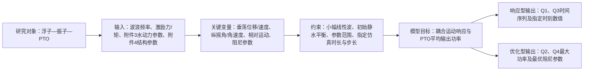

# 题目简报

owner_name: 罗懿
owner_code: L
owner_role: 建模手
version: global
status: draft
based_on: 题目信息/A题/A题.pdf

## 题目名称与来源

- 题目：2022 年高教社杯全国大学生数学建模竞赛 A 题“波浪能最大输出功率设计”
- 题面来源：`题目信息/A题/A题.pdf`（3 页，SHA-256：`E29940EB9EB9382DEB8ECCB459C73CC47F0080483B8B75F9977830C987162253`）
- 复核状态：已将 PDF 文本提取结果与第 1–3 页渲染图逐页对照，题名、四个问题、图 1/图 2、附件说明及关键数值未发现实质冲突。

## 一句话本质

本题要为“浮子—振子—能量输出系统（power take-off，PTO）”建立受波浪驱动的耦合动力学模型，先预测装置在垂荡及垂荡—纵摇耦合状态下的时间响应，再通过选择直线阻尼和旋转阻尼参数，使 PTO 的平均输出功率达到最大。

## 研究对象与能量链

装置由外部浮子、内部振子、中轴以及弹簧和阻尼器组成。波浪对浮子施加周期激励力和激励力矩；浮子的运动通过中轴、弹簧与阻尼器带动振子。浮子与振子之间的相对直线运动和相对转动使阻尼器做功，由此把波浪机械能转化为可输出能量。

题面给出的主要水动力作用包括：波浪激励力（矩）、附加惯性力（矩）、兴波阻尼力（矩）和静水恢复力（矩）。因此，统一的建模主线是：

1. 用附件参数描述浮子、振子、弹簧及给定频率下的水动力特性；
2. 建立浮子与振子的耦合运动方程；
3. 由相对速度和相对角速度计算 PTO 瞬时功率及平均功率；
4. 分别完成给定阻尼下的时域响应计算和阻尼参数优化。

## 四个问题的核心任务

| 问题 | 运动范围 | 核心任务 | 关键条件 | 必交结果 | 后续负责阶段 |
|---|---|---|---|---|---|
| Q1 | 仅垂荡 | 建立浮子—振子二自由度垂荡模型，对常量直线阻尼和速度相关直线阻尼两种情形进行时域计算 | `ω=1.4005 s⁻¹`；初始静水平衡；前 40 个波浪周期；步长 `0.2 s`；常量阻尼 `10000 N·s/m`；非线性情形比例系数 `10000`、幂指数 `0.5` | 完整序列写入 `result1-1.xlsx`、`result1-2.xlsx`；论文列出 `10、20、40、60、100 s` 时浮子与振子的垂荡位移和速度 | 模型：`model-formalization`；算法：`algorithm-spec`；结果：`result-analysis` |
| Q2 | 仅垂荡 | 在 Q1 垂荡模型基础上优化直线阻尼参数，使 PTO 平均输出功率最大 | `ω=2.2143 s⁻¹`；常量阻尼系数范围 `[0,100000]`；速度相关情形的比例系数范围 `[0,100000]`、幂指数范围 `[0,1]` | 两类阻尼规律各自的最大平均输出功率及最优参数 | 模型：`model-formalization`；算法：`algorithm-spec`；结果：`result-analysis` |
| Q3 | 垂荡与纵摇耦合 | 建立浮子与中轴/振子的平动—转动耦合模型，同时考虑直线 PTO、旋转 PTO 和扭转弹簧 | `ω=1.7152 s⁻¹`；初始静水平衡；前 40 个波浪周期；步长 `0.2 s`；直线阻尼 `10000 N·s/m`；旋转阻尼 `1000 N·m·s` | 完整序列写入 `result3.xlsx`；论文列出 `10、20、40、60、100 s` 时浮子与振子的垂荡位移/速度及纵摇角位移/角速度 | 模型：`model-formalization`；算法：`algorithm-spec`；结果：`result-analysis` |
| Q4 | 垂荡与纵摇耦合 | 在 Q3 耦合模型基础上联合优化常量直线阻尼和旋转阻尼，使总平均输出功率最大 | `ω=1.9806 s⁻¹`；两个阻尼系数均在 `[0,100000]` 内取值 | 最大平均输出功率、最优直线阻尼系数、最优旋转阻尼系数 | 模型：`model-formalization`；算法：`algorithm-spec`；结果：`result-analysis` |

## 输入资料与用途

| 输入 | 主要内容 | 关联问题 |
|---|---|---|
| `附件1.gif` | 装置仅做垂荡时的运动示意 | Q1、Q2 |
| `附件2.gif` | 装置同时垂荡和纵摇时的运动示意 | Q3、Q4 |
| `附件3.xlsx` | 不同入射波浪频率下的附加质量、附加转动惯量、兴波阻尼系数和波浪激励力（矩）振幅 | Q1–Q4 |
| `附件4.xlsx` | 浮子与振子的物理参数和几何参数 | Q1–Q4 |
| `result1-1.xlsx`、`result1-2.xlsx`、`result3.xlsx` | 题目指定的结果填写模板 | Q1、Q3 |

本阶段只登记资料用途，不对附件 3、附件 4 做清洗、插值或参数选取；这些工作属于后续数据检查和模型建立阶段。

## 统一条件与边界

- 海水按无粘、无旋处理，波浪为线性周期微幅波。
- 忽略中轴、底座、隔层和 PTO 的质量以及各种摩擦。
- Q1、Q3 均从浮子和振子在静水中的平衡状态开始。
- 题中频率均指圆频率，角度均使用弧度制。
- Q1、Q2 只考虑垂荡；Q3、Q4 同时考虑垂荡与纵摇。
- 装置输出来自浮子与振子之间的相对运动；Q3、Q4 的总输出应同时计入直线阻尼器和旋转阻尼器的做功。
- Q2 依赖 Q1 的垂荡动力学框架，Q4 依赖 Q3 的垂荡—纵摇耦合动力学框架，但两道优化题使用各自指定的波浪频率和参数。

## 核心建模难点

1. **水动力与结构动力学的统一。** 附加质量/转动惯量会改变等效惯性，兴波阻尼和静水恢复项又分别与速度、位移或转角相关，必须与浮子—振子的弹簧和阻尼耦合保持一致的符号、单位和方向。
2. **速度相关非线性阻尼。** Q1(2)、Q2(2) 中的阻尼系数随相对速度绝对值的幂变化，运动方程和功率表达均为非线性，不能直接沿用常量阻尼情形的线性结论。
3. **垂荡—纵摇耦合。** Q3、Q4 至少涉及浮子垂荡、振子沿轴滑动、浮子纵摇和中轴/振子转动；转动几何、相对角位移、相对角速度及力矩方向需要统一定义。
4. **“最大平均功率”的计算口径。** 优化前需明确平均区间是否覆盖全部模拟时段或只取稳态段，并检查瞬态初值是否影响最优参数。

## 简化问题模型图

文字版：波浪与装置参数输入 → 建立浮子—振子耦合动力学 → 得到相对平动/转动响应 → 计算直线与旋转阻尼做功 → 输出时间响应，或在参数范围内寻找平均功率最大值。

## 待确认与后续检查

- `[MODELER INPUT NEEDED 1]` 平均输出功率采用“全模拟区间平均”还是“剔除瞬态后的稳态平均”？建议两者都计算并比较最优参数的稳定性。
- `[MODELER INPUT NEEDED 2]` 统一垂荡正方向、纵摇正方向、浮子与振子相对量的定义，并据此检查所有恢复力、阻尼力和力矩符号。
- `[MODELER INPUT NEEDED 3]` 数据检查阶段确认附件 3 是否直接包含四个指定频率；若没有，需先确定水动力参数的插值规则，不能静默取邻近频率。

## 当前边界

本简报只回答题目的本质要求、核心问题和最终交付物；尚未完成附件数据审计、候选方法筛选、方程定稿、数值求解或最优参数计算。
